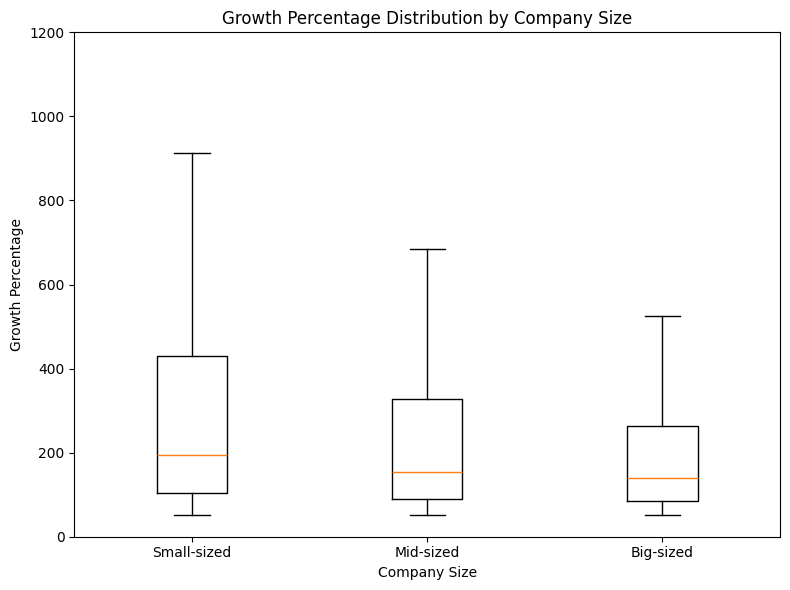

# Inc. 5000 (2019) Data Analysis 📊

A small data analysis project using the **Inc. 5000 Companies 2019** dataset.  
The notebook focuses on **data cleaning**, **EDA**, and extracting business insights related to **company growth**, **industries**, and **company size**.

---

## 📌 Dataset
Source (Kaggle): Inc. 5000 Companies 2019  
https://www.kaggle.com/datasets/07b43fabef2f773ede5a6f1d2bcec3682435897e8854d087e82a0babf0806ca0

> Note: The dataset is not included in this repo.  
> Download it from Kaggle and place the CSV file inside the `data/` folder.

Expected path:
- `data/INC_5000_Companies_2019.csv`

---

## ✅ Key Highlights
- Computed the **average growth percentage** of companies.
- Identified the **top 5 fastest-growing companies** based on growth rate.
- Analyzed **industry distribution** and showed which industries dominate the Inc. 5000 list.
- Added company segmentation based on workforce size (**Small / Mid / Big**) and compared growth using a boxplot.

---

## 📊 Visual Insights

### Companies per Industry


### Growth Distribution by Company Size


---

## 📦 Requirements
- Python 3.9+
- Jupyter Notebook

---

## 🚀 How to Run

### Option 1: Run locally
```bash
# Clone the repository
git clone https://github.com/MazenShashar28/Inc.-5000--2019--Data-Analysis.git
cd Inc.-5000--2019--Data-Analysis

# Create a virtual environment (recommended)
python -m venv venv
venv\Scripts\activate

# Install dependencies
pip install -r requirements.txt

# Run Jupyter Notebook
jupyter notebook
```

---

## 👤 Author
**Mazen Sharshar**
